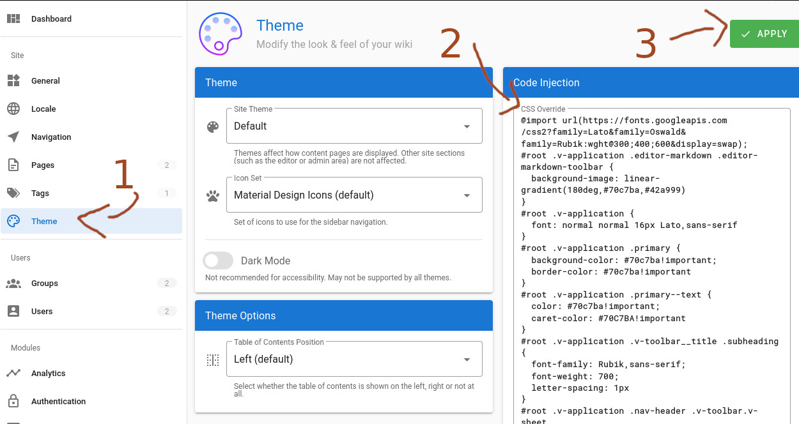

# WikiJS Theme for Kaspa Wiki
A theme for the [Kaspa Wiki](https://wiki.kaspa.org).

## Installation

You can use the theme directly by copying the [compiled theme](https://github.com/thuun/wiki-js-kaspa/blob/master/theme/publish/wiki.css) into your WikiJS instance. 

1. Login with an administrator account and navigate to Administration (top right gear), then "Themes".
2. Paste [this CSS](https://github.com/thuun/wiki-js-kaspa/blob/master/theme/publish/wiki.css) into the "CSS Override" textbox.
3. Then click Apply.



> :bulb: This is not a theme "package", instead it is provided as simple CSS overrides to the standard WikiJS theme.

-----

## Development
These instructions assume you are running a modern x86 linux OS. You will need to adapt them accordingly to your OS if you are running something different.

To build the theme, you'll need `sass` and `esbuild`.    
To install these on a linux system for all users, you can run the following as root:
```sh
curl -L "https://github.com/sass/dart-sass/releases/download/1.69.5/dart-sass-1.69.5-linux-x64.tar.gz" \
  -o /tmp/dart-sass.tar.gz \
  && tar -xzf /tmp/dart-sass.tar.gz -C /tmp/ \
  && rm -rf /usr/share/dart-sass \
  && mv -f /tmp/dart-sass /usr/share/ \
  && chown root:root -R /usr/share/dart-sass \
  && echo "export PATH=\$PATH:/usr/share/dart-sass" >> /etc/profile
curl -L "https://registry.npmjs.org/@esbuild/linux-x64/-/linux-x64-0.19.4.tgz" \
  -o /tmp/esbuild.tar.gz \
  && tar -xzf /tmp/esbuild.tar.gz -C /tmp/ \
  && mv -f /tmp/package/bin/esbuild /usr/bin \
  && chown root:root -R /usr/bin/esbuild
```

To build the theme, cd into `theme/` and then run either the build script `build.sh` or execute commands separately:
```sh
sass --no-source-map kaspa-wiki.scss publish/wiki.css
esbuild kaspa-wiki.js --bundle --outfile=publish/wiki.js --format=iife
```

*Optionally* you can instead affix the `--watch` argument to these commands to watch the theme files for changes and automatically have them recompiled.

### Testing in a Local WikiJS
Docker is used to spin up a test instance of WikiJS. You can then configure and test the theme without impacting live systems.

You'll want to create a peristent data folder for the docker wikiJS database:
```sh
mkdir data && chmod 777 data
```

Then you can run the wikijs docker image in two ways:

Either in daemon mode:
```sh
docker run -d -p 8080:3000 --name wikijs --restart unless-stopped -e DB_TYPE=sqlite -e DB_FILEPATH=/srv/db.sqlite -v "$(pwd)/data:/srv:rw" requarks/wiki
```

or on your current terminal:
```sh
docker run -p 8080:3000 --name wikijs --restart unless-stopped -e DB_TYPE=sqlite -e DB_FILEPATH=/srv/db.sqlite -v "$(pwd)/data:/srv:rw" requarks/wiki
```
